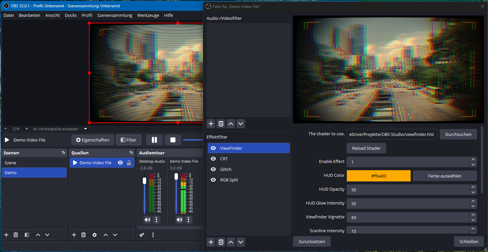
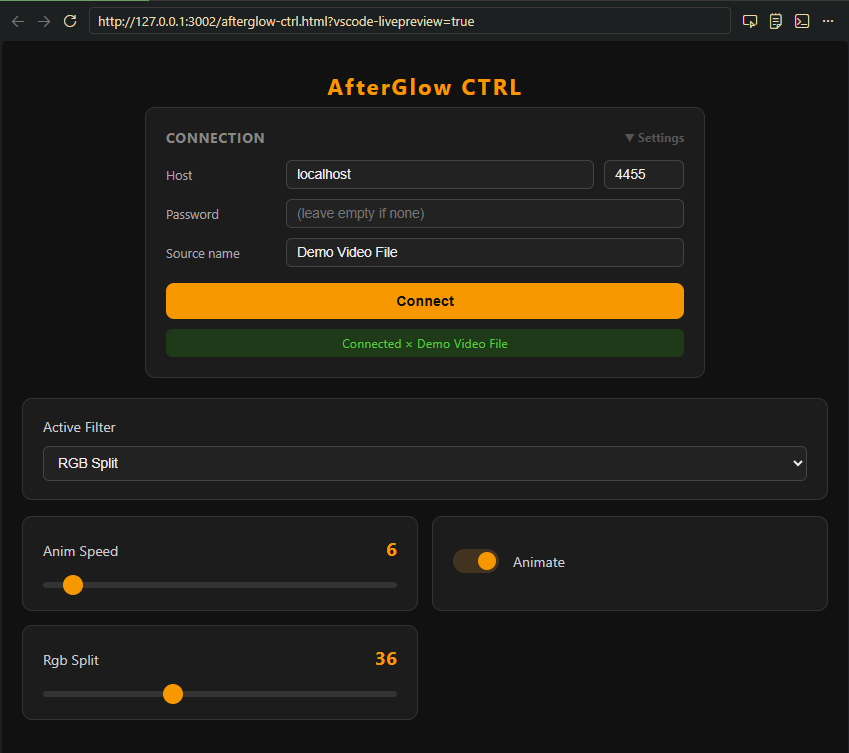

# AfterGlow — Demo

→ [demo.mp4](demo.mp4)

Original Video von Ray.: https://www.pexels.com/de-de/video/stadt-strasse-verkehr-skyline-17701662/

## Filters used in this demo

| Filter | File |
|---|---|
| Viewfinder | `viewfinder.hlsl` |
| CRT | `crt.hlsl` |
| Glitch | `glitch.hlsl` |
| RGB Split | `rgb_split.hlsl` |

## Usage in OBS

→ [obs-demo.mp4](obs-demo.mp4)

Original Video from Efrem Efre: https://www.pexels.com/de-de/video/35652450/

## About the setup

All four filters are stacked on a single webcam source in OBS. The **Enable Effect** parameter on each filter is set to `1` or `0` to switch them on and off live — without removing or re-adding the filter.

The [AfterGlow browser controller](../web/afterglow.html) (`web/afterglow.html`) was used to adjust parameters in real time via OBS WebSocket while recording.

→ [Back to main readme](../readme.md)
